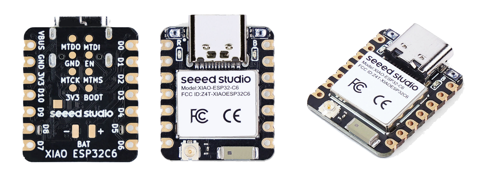
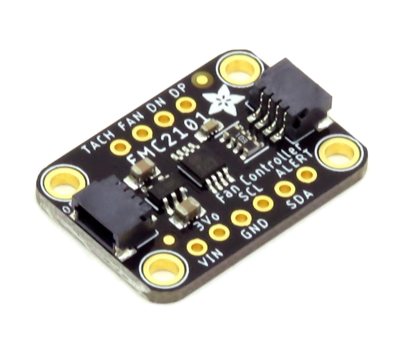

# Equipment (Host)

The following equipment is what we will be using for this process.  Getting a board with a lower memory amount is a bit less but I wouldn't go below 2GB as there are a number of things we will want to run on the board such as a container runtime to make things a bit cleaner and easier to update.

* Orange PI Zero 2W - 4GB
* USB-C Power supply with switch
* Mini HDMI to HDMI cable 
* 128 GB MicroSD memory card

I have purchased many different Raspberry Pi boards over the years but have been pretty impressed with the Orange Pi with the external antenna mount, larger memory sizes, USB-C power jacks all on a small form factor board.

# ESP32 Equipment (Sensor)

Much like the Raspberry Pi boards, I have had a lot of different ESP32 boards over the years.  I am a fan of the Seeed Studio XIAO series of boards that fit inside of size of a quarter.   Like the Orange Pi they also have a external antenna mount since where we mount the board might not be ideal for good reception or we might want a higher gain antenna for a remote installation outside.

The thumbsized XIAO has Wifi 6, BLE 5.0, Zigbee, Thread, Matter, battery charge curcuit and pads.

* Seeed XIAO ESP32-C6
* I2C Qwiic Cable Kit Stemma QT Wire
* Sensors
    * SHT41 Temperature and Humidity with QWIIC Interface
    * EMC2101 I2C PC Fan Controller and Temperature Sensor with QWIIC Interface

