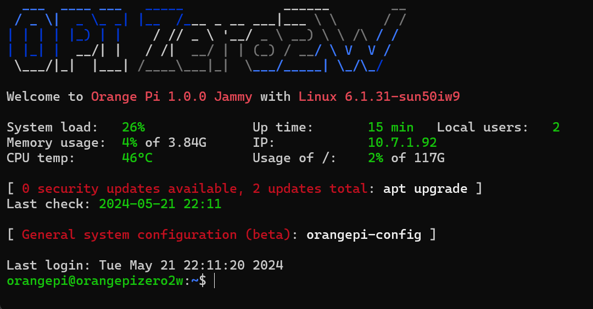

# Provisioning

## OS Installation

In the case of our board which is a Orange Pi Zero 2W, we go to the OrangePi.com website and go to downloads.  These images have been configured for use with the Allwinner H618 quad-core Cortex-A53 processor.

1. Download the Ubuntu image for the board type / memory size.  I downloaded the Ubuntu server image as I don't need a GUI/Desktop

1. Uncompress the downloaded OS image

1. Download [Etcher utility](https://etcher.balena.io/#download-etcher) for writing iso file to MicroSD card.

1. Plug in MicroSD and run etcher utility.

1. Write ISO image to microSD card

1. Insert microSD card into Orange Pi memory slot

1. Plug in HDMI, USB and Power cables

## OS Configuration

As the Orange Pi boots it will expand the disk partition to fill the entire microSD card.  After partition expansion all the services will be configured and when it is all done you should get a screen that looks like this:

Next we need to update the hostname, timezone, etc by typing in:

    sudo orangepi-config
    
The default password is **orangepi**

### System Settings

* Avahi: enable Avahi 
* Hardware: enable all the i2c, pwm, and uart
* Firmware: run updates and reboot

The board will reboot and show the welcome screen again.

TIP: You can press the up arrow and down arrow to switch between the various last command line statements even after a reboot.   Go back into orangepi-config

### Network Settings

* IPv6: Disable
* Wifi: Connect to wireless network

### Personal Settings

* Timezone: set to your timezone
* Hostname: change to something cool

After all your settings exit and type in:

    sudo reboot -n

## Security Cleanup

After rebooting it is often a lot easier to make changes over SSH instead of on the console with mini keyboard.

Connect to the device by going to the command prompt and typing in below switching out **opz2w** with whatever hostname you picked that was cool

    ssh orangepi@opz2w

In order to change the orangepi username you must first set a password for root so you can login as that account and change the other.

    sudo passwd root

Now set a password for the orangepi user so it isn't just **orangepi**

    sudo passwd

Type logout and then change your SSH command to the below changing the host name to your host name:

    ssh root@opz2w

Then to change the usern type in the following two commands replacing 'newname' with whatever

    usermod -l newname orangepi
    usermod -m -d /home/myname newname

Change auto login

    sudo nano /lib/systemd/system/getty@.service.d/override.conf

Update the autologin line to:

    ExecStart=-/sbin/agetty --noissue %I $TERM

After you have renamed the default user you can disable the root user by typing in this:

    sudo passwd -l root

You should also turn off the permit login as root here:

    sudo nano /etc/ssh/sshd_config