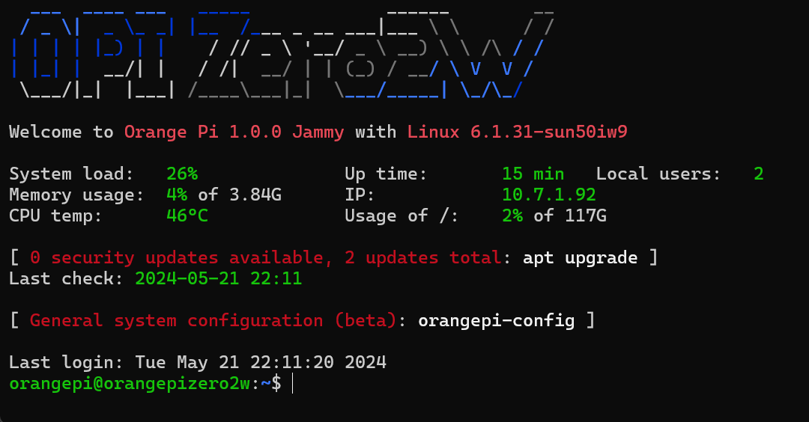

# OS Installation

In the case of our board which is a Orange Pi Zero 2W, we go to the OrangePi.com website and go to downloads.  These images have been configured for use with the Allwinner H618 quad-core Cortex-A53 processor.

1. Download the Ubuntu image for the board type / memory size.  I downloaded the Ubuntu server image as I don't need a GUI/Desktop

1. Uncompress the downloaded OS image

1. Download [Etcher utility](https://etcher.balena.io/#download-etcher) for writing iso file to MicroSD card.

1. Plug in MicroSD and run etcher utility.

1. Write ISO image to microSD card

1. Insert microSD card into Orange Pi memory slot

1. Plug in HDMI, USB and Power cables

## OS Configuration

As the Orange Pi boots it will expand the disk partition to fill the entire microSD card.  After partition expansion all the services will be configured and when it is all done you should get a screen that looks like this:



### Set Passwords

First thing we should always do is reset and default passwords.

Set the root password (so we can login as root later):
```bash
sudo passwd root
```
(Default password is **orangepi**)

Next set the autologin user password:
```bash
passwd
```

TIP: You can press the up arrow and down arrow to switch between the various last command line statements even after a reboot.   Go back into orangepi-config


### Attach to Wireless Network

Next we need to update the hostname, and attach it to wifi:

    sudo orangepi-config
    
#### Network Settings

* Wifi: Connect to wireless network

#### Personal Settings

* Timezone: set to your timezone
* Hostname: change to something cool

After all your settings exit and type in:

    sudo reboot -n

Once the system reboots you can stop using the attached monitor and keyboard as you will now be able to login using SSH

From your computer type in the following:
```bash
ssh root@NEW_HOST_NAME
```
