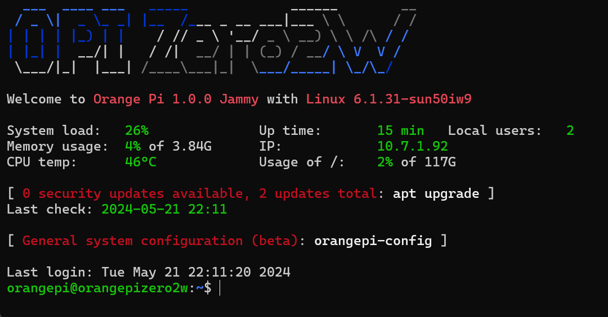

# OS Installation

In the case of our board which is a Orange Pi Zero 2W, we go to the OrangePi.com website and go to downloads.  These images have been configured for use with the Allwinner H618 quad-core Cortex-A53 processor.

1. Download the Ubuntu image for the board type / memory size.  I downloaded the Ubuntu server image as I don't need a GUI/Desktop

1. Uncompress the downloaded OS image

1. Download [Etcher utility](https://etcher.balena.io/#download-etcher) for writing iso file to MicroSD card.

1. Plug in MicroSD and run etcher utility.

1. Write ISO image to microSD card

1. Insert microSD card into Orange Pi memory slot

1. Plug in HDMI, USB and Power cables

## OS Configuration

As the Orange Pi boots it will expand the disk partition to fill the entire microSD card.  After partition expansion all the services will be configured and when it is all done you should get a screen that looks like this:



Next we need to update the hostname, timezone, etc by typing in:

    sudo orangepi-config
    
The default password is **orangepi**

### System Settings

* Avahi: enable Avahi 
* Hardware: enable all the i2c, pwm, and uart
* Firmware: run updates and reboot

The board will reboot and show the welcome screen again.

TIP: You can press the up arrow and down arrow to switch between the various last command line statements even after a reboot.   Go back into orangepi-config

### Network Settings

* IPv6: Disable
* Wifi: Connect to wireless network

### Personal Settings

* Timezone: set to your timezone
* Hostname: change to something cool

After all your settings exit and type in:

    sudo reboot -n

Do a update and upgrade:
```bash
sudo apt update

sudo apt upgrade
```

Do a kernal update:
```bash
sudo apt full-upgrade
```

Allow any held back packages to update
```bash
sudo apt dist-upgrade
```

Remove any packages no longer neeed
```bash
sudo apt autoremove
```